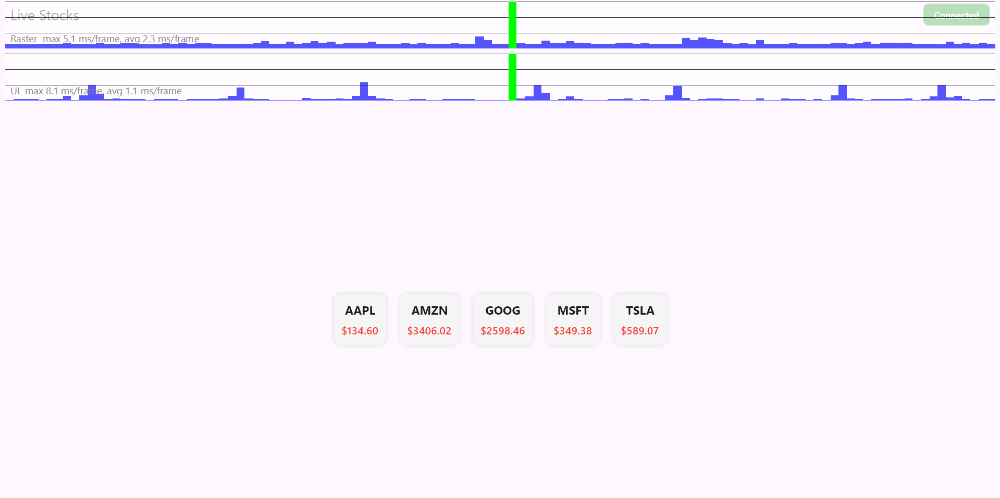

# Stock Viewer App

A real-time Flutter WebSocket stock viewer that displays live prices for stocks with anomaly detection, connection state tracking, and performance optimization.

---

## 🚀 Features

### ✅ Core Functional Requirements
- **Single Screen** UI displaying a list of stocks
- **Live Price Updates** via WebSocket
- **Price Flashing:**
  - Green for increase
  - Red for decrease
- **Persistent Connection Status** shown in AppBar

### ✅ Advanced Challenge #1: Network Resilience
- Robust WebSocket handling
- Handles malformed JSON without crashing
- **Exponential Backoff Reconnect**: 2s → 4s → 8s → … up to 30s

### ✅ Advanced Challenge #2: Anomaly Detection
- Detects and ignores **anomalous price drops >50%**
- Displays ⚠️ icon for affected stocks

### ✅ Advanced Challenge #3: Performance Optimization
- Efficient state handling
- **Minimal rebuilds** with `AnimatedSwitcher`
- Smooth UI with low frame render times (confirmed via DevTools)

---

## 🛠️ Setup Instructions

1. Clone the repository
```bash
git clone https://github.com/your-username/stock-viewer.git
cd stock-viewer
```

2. Get dependencies
```bash
flutter pub get
```

3. Run the app
```bash
flutter run -d chrome # or any connected device
```

> Make sure your backend WebSocket server is running at `ws://127.0.0.1:5000/ws`

---

## 🧠 Architectural Decisions

- **State Management:** `StatefulWidget` + in-place logic using Maps & Sets to avoid overkill for a simple app
- **Connection Logic:** Persistent `WebSocket` managed via lifecycle; reconnect with exponential backoff
- **Widget Optimization:** Uses `AnimatedSwitcher` for price updates, avoids rebuilding entire lists
- **UI Separation:** Each stock is rendered with individual price change detection and anomaly flag

---

## ⚠️ Anomaly Detection Heuristic

### Rule:
- If a stock's price drops by more than 50% compared to its last known value, it's flagged as anomalous and ignored for updating.

### Rationale:
- In a realistic market, a 50%+ drop in one second is highly unlikely

### Trade-offs:
- **False Positives:** May discard valid data during real market crashes
- **False Negatives:** May not detect slow but large declines
- Chosen for simplicity and robustness in noisy environments

---

## 📊 Performance Analysis

### DevTools Screenshot


- UI Thread: ~1 ms/frame average
- Raster Thread: ~2–3 ms/frame average
- ✅ No frame jank observed

### Performance Techniques Used:
- Minimal use of `setState` (only when price changes)
- `AnimatedSwitcher` scoped to price text
- No unnecessary widget rebuilds

---

## 📬 Feedback
Found a bug or have an idea? Open an issue or PR!
